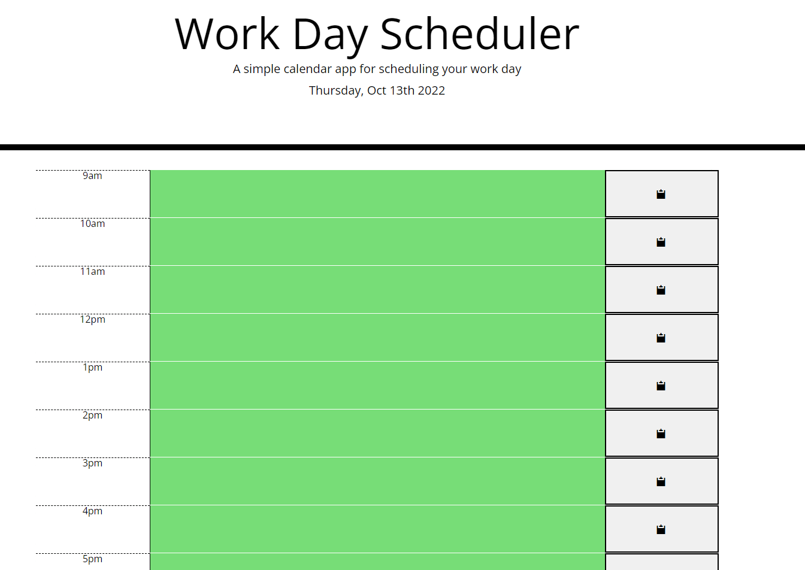

# Work Day Scheduler

Work day scheduler is an app/website that is used to plan your day

The hours run from 9am-5pm and each hour has a description that can be updated by clicking the hour and typing an event

Click the save button on the right side to store that event on the schedule in case you need to reload the page

If the time of day is before a scheduled event that hour will display green, if the time is current it will display red and if it is after then the event will display gray

<a href="https://morettilouie.github.io/Scheduler/">Live URL from github</a>